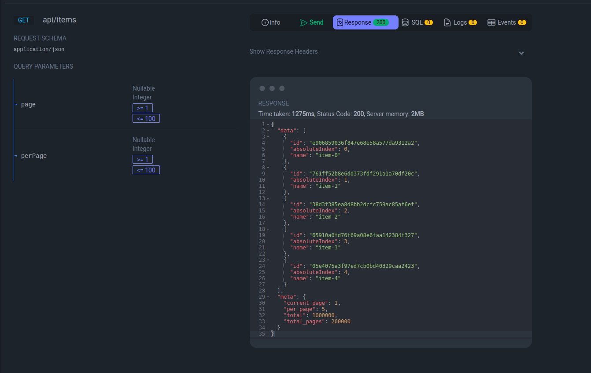
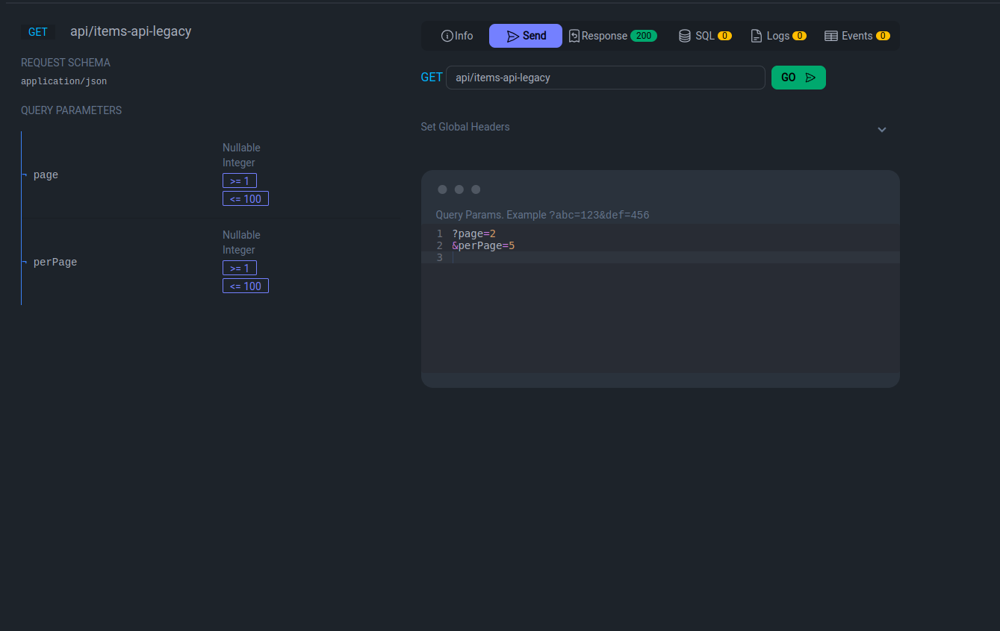
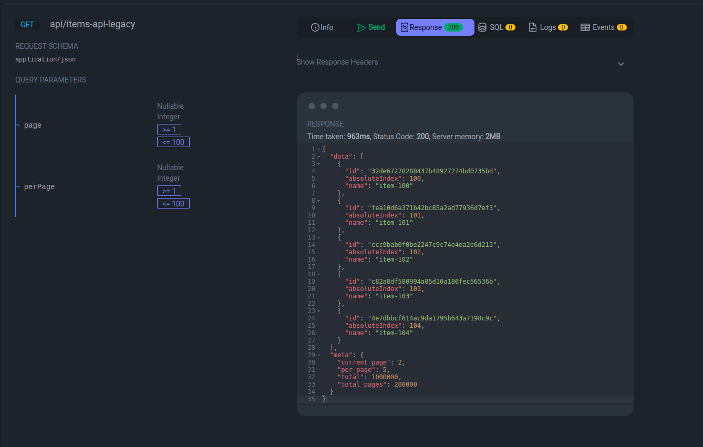

## About
There's this legacy API that contains info gathered across decades of existence.
Your team needs to use one of the endpoints of that API to build a new web app.
The problem is that this specific endpoint returns millions of items,
paginated at 100 per page. Since you will need more flexibility in terms of
page size, your team decides to build a frontend for this legacy API that will
allow a user defined value for the number of items per page.
You'll be in charge of this task. Here's what you need to do:

- Create a simple API with just one required endpoint: GET /items.
- This new API will return the list of items of the legacy API, but will accept a page and perPage arguments returning accordingly.

Here's what you need to know about the legacy API:

- The legacy API is at http://sf-legacy-api.now.sh
- A simple GET /items will return the first 100 items.
- To go to a specific page you use GET /items?page=20 for instance.
- The response will contain info about the total number of items, the current page and how many items per page.

## Solution

Made using the Laravel 10 framework and Docker for application containerization.

## How to run the project

After downloading the **backend-challenge** repository, being in its main folder, go up the structure composed of the following containers:

- **backend-challenge:** Composed with nginx and PHP, being exposed to port `9000`;

1) Through the following commands:
```sh 
docker-compose build
```
```sh 
docker-compose up -d
```

Now we can use and test the application through the address "http://127.0.0.1:9000/request-docs"
If you want to run the application later, check if the `backend-challenge` container is active
executing the following command:

```sh
docker container ls -a
```
If you want to start the `backend-challenge` container, run the following command:
```sh
docker container start backend-challenge
```
If you want to stop the `backend-challenge` container, run the following command:
```sh
docker container stop backend-challenge
```
## Tests
Tests were created as an automated way to prove that it is working correctly.
- Command to run all tests at once:
```sh
docker container exec -it backend-challenge php artisan test --filter=ItemControllerTest
```
- You also can run the tests one by one this way:
#### Original route test.
```sh
docker container exec -it backend-challenge php artisan test --filter=ItemControllerTest::testItemsReturnsJsonResponse
```
#### Legacy route test.
```sh
docker container exec -it backend-challenge php artisan test --filter=ItemControllerTest::testIndexApiLegacyReturnsJsonResponse
```


## Observations

I had an alternative understanding regarding the data brought from the legacy api,
so I optionally created a new route that can be accessed
at `http://127.0.0.1:9000/api/items-api-legacy`

- `http://127.0.0.1:9000/api/items`

* This route will always bring the first 100 records from page 1 of the legacy API, this was the understanding I had when reading the challenge.




- `http://127.0.0.1:9000/api/items-api-legacy`
* Route created alternatively for a slightly different understanding of the previous route.
  For this route, the page parameter will be passed to the legacy API so that pagination will be
  based on the data returned and not the first 100 records.
  
  
